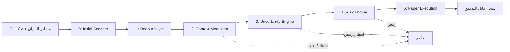

# المعمارية

## تدفق القرار

## قواعد التصميم

يعمل كل مكوّن على مدخلات صريحة ويعيد نتيجة منظمة مع أسباب القرار. لا تعتمد طبقة المخاطر على درجة ثقة النموذج وحدها، ولا تستطيع طبقات النماذج تجاوز حد الخسارة اليومية أو الحد الأقصى للمراكز. أُبقيت LSTM وTransformer كنقاط تمديد؛ فالنظام الأساسي لا يدّعي تدريب نموذج عميق من دون بيانات موسومة وفحص زمني مستقل.

تستخدم الاختبارات التاريخية نافذة البيانات السابقة فقط عند بناء الإشارة. وعند اصطدام الشمعة المستقبلية بالوقف والهدف معاً، يطبق الاختبار السلوك المحافظ بافتراض تنفيذ الوقف أولاً. يجب إضافة العمولات والانزلاق ومشكلات جودة البيانات إلى أي تقييم قبل اعتباره دليلاً.

## حواجز التداول

| الحاجز | السلوك |
|---|---|
| الوضع | `paper` فقط في الإعداد الافتراضي. |
| التنفيذ الحي | `LiveExecutionGuard` يرفع استثناءً دائماً. |
| الخسارة اليومية | يتوقف إنشاء خطط جديدة عند بلوغ 2% من رأس المال. |
| مخاطرة الصفقة | تُحسب عند 1% من رأس المال، ويخفضها السياق عند الحاجة. |
| نسبة العائد/المخاطرة | تُرفض الخطة تحت 1:3. |
| أمر الدخول | Limit Order ورقي مقسم إلى 3–4 شرائح. |
| الجاهزية | 90 يوماً ورقياً و60 صفقة ونسبة فوز ≥55%؛ لا تفتح التداول الحي تلقائياً. |

## مصدر البيانات

يمكن تحميل ملفات CSV للتحقق والتجارب. موصل OANDA للشموع التاريخية للقراءة فقط، وموصل MT5 للشموع التاريخية عند توفر مكتبة MT5. لا يحتوي أي موصل في الإصدار الحالي على دالة إرسال أمر حقيقي.
